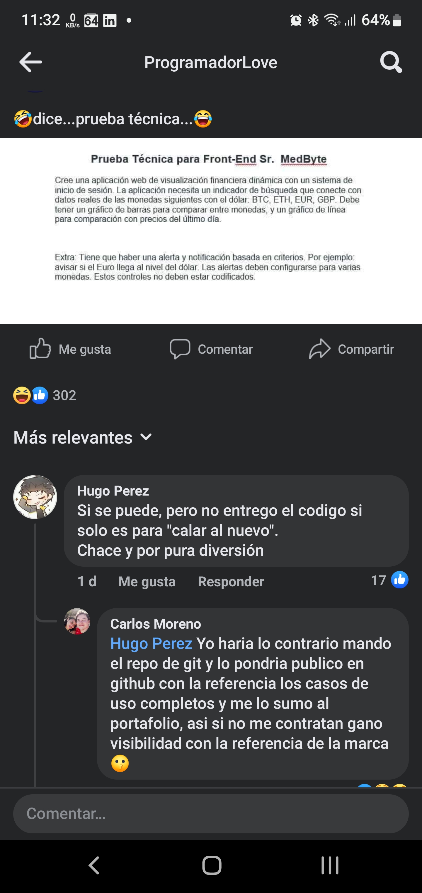
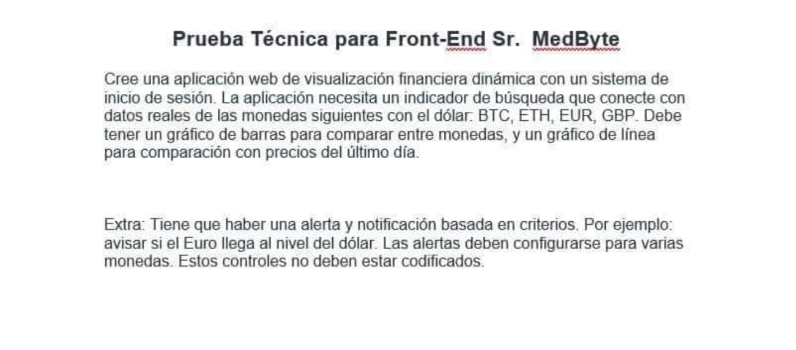

# Prueba medByte

Prueba tecnica de medByte, aclaracion:

    - No he sido candidato para la vacante.
    - No reconozco que la vacante sea verdadera o una simple broma.
    - Realizo el ejercicio con fines educativos. 
    - No reconozco a la empresa (si fuese real o no) que bajo suposicion oferta la prueba tecnica.

---

Requerimientos:

- [ ] Aplicacion web en Javascript SPA
- [ ] Autenticacion  
- [ ] Pantalla de Busqueda Monedas
- [ ] Conexion a API de Monedas
    - [x] Pruebas servicio de Monedas seleccionado coingecko
    - [x] Creado servicio de consulta
- [ ] Pantalla comparacion Monedas
- [ ] Graficos 
- [ ] Variacion de precios Diarios

Extra:

- [ ] Notificaciones 
- [ ] Notificaciones configurables

